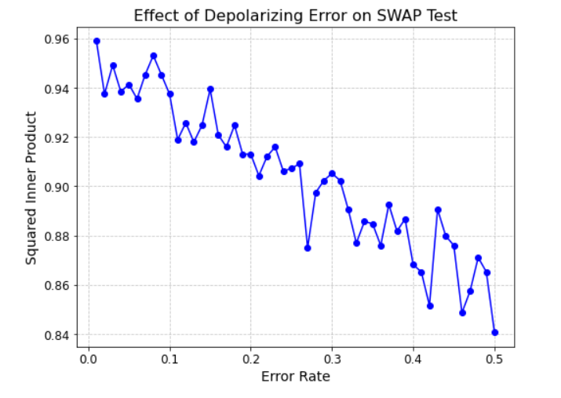
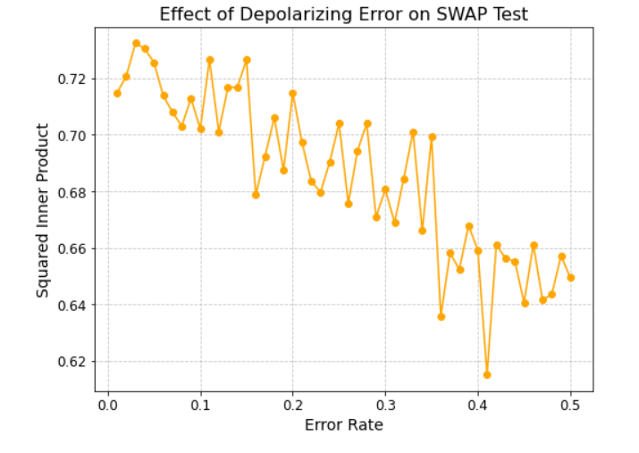
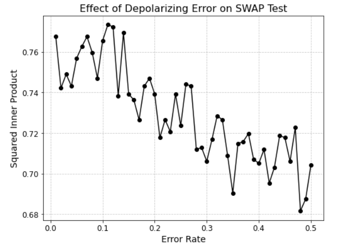

# QOSF_Task4_Abhinaba
## Introduction
The Swap test is a mathematical technique for testing how alike two quantum states are. This test is also a useful test for entanglement of pure states. Swap test is also widely used in quantum machine learning. 

## Depolarization and error mitigation
Depolarization error in qubits is a specific type of noise or error that affects the reliability and accuracy of quantum computations performed on qubits.
Depolarization errors in qubits can be caused by various factors, including environmental interference, electromagnetic radiation, temperature fluctuations, and interactions with nearby particles. These external influences can disrupt the quantum coherence of qubits. Depolarization errors are often mathematically represented as a depolarizing channel. This channel acts probabilistically, randomly applying Pauli X, Y, or Z gates to the qubit with some probability. These Pauli gates introduce errors and cause the qubit's state to evolve in an unpredictable manner. The severity of depolarization error is quantified by an error rate. This rate represents the probability that a qubit will experience a depolarizing error during a quantum operation. Lower error rates are desired for achieving high-fidelity quantum computations. In this task, I have used error rate upto .5 starting from 0.01 in a step of 0.0098. To mitigate the impact of depolarization errors and enhance the reliability of quantum computations, quantum error correction codes are used. These codes involve encoding quantum information redundantly to detect and correct errors that occur during quantum operations.

## Code
```python
#-------------------------Part 1--------------------------------#
    
import numpy as np
from math import*
import matplotlib.pyplot as plt
from qiskit import QuantumCircuit, Aer, execute
from qiskit.visualization import plot_histogram
from qiskit.providers.aer.noise import depolarizing_error

#---------------------------------------------------------------#

# Define the two quantum states 
state1 = [sqrt(0.3), sqrt(0.7)]  #|A>
state2 = [sqrt(0.6), sqrt(0.4)]  #|B>

# Create a function to generate the SWAP test circuit with noise
def swap_test(error_rate):
    # Create a quantum circuit with three qubits
    circuit = QuantumCircuit(3, 1)
    
    # Encode the two states into qubits 0 and 1
    circuit.initialize(state1, 0)
    circuit.initialize(state2, 1)
    
    # Apply a depolarizing error to qubit 1
    error = depolarizing_error(error_rate, 1)
    circuit.append(error, [1])
    
    # Create an equal superposition on qubit 2
    circuit.h(2)
    
    # Apply SWAP test
    circuit.cswap(2, 0, 1)
    
    circuit.h(2)
    
    # Measure the third qubit
    circuit.measure(2, 0)
    
    return circuit

# Define a range of error rates and simulate the SWAP test for each rate
error_rates = np.linspace(0.01, 0.50, 50)  # Varying error rates

results = []

for error_rate in error_rates:
    circuit = swap_test(error_rate)
    
    # Simulate the circuit
    simulator = Aer.get_backend('qasm_simulator')
    job = execute(circuit, simulator, shots=1024)
    result = job.result()
    counts = result.get_counts()
    
    # Calculate the probability of measuring |0⟩
    if '0' in counts:
        prob_0 = counts['0'] / 1024
    else:
        prob_0 = 0
    
    results.append(prob_0)

# Plot the results to observe the effect of varying error rates on the SWAP test outcome
"""plt.plot(error_rates, results)
plt.xlabel('Error Rate')
plt.ylabel('Probability of Measuring |0⟩')
plt.title('Effect of Depolarizing Error on SWAP Test')
plt.grid(True)
plt.show()
print(circuit)"""

fig, ax = plt.subplots(figsize=(8, 6))
ax.plot(error_rates, results, marker='o', linestyle='-', color='b')
ax.set_xlabel('Error Rate', fontsize=14)
ax.set_ylabel('Squared Inner Product', fontsize=14)
ax.set_title('Effect of Depolarizing Error on SWAP Test', fontsize=16)
#ax.legend(fontsize=12)
ax.grid(True)
ax.grid(True, linestyle='--', alpha=0.7)
ax.tick_params(axis='both', which='major', labelsize=12)
plt.show()
gate_count = circuit.size()
print("Gate Count: ", gate_count)
print(circuit)
```

```python
#-------------Part 2---------------------------#
import numpy as np
from math import sqrt
import matplotlib.pyplot as plt
from qiskit import QuantumCircuit, Aer, execute
from qiskit.visualization import plot_histogram
from qiskit.providers.aer.noise import depolarizing_error

#---------------------------------------------#

# Define the two quantum states 
state1 = [sqrt(0.1), sqrt(0.2), sqrt(0.6), sqrt(0.1)]  # |A⟩
state2 = [sqrt(0.0), sqrt(0.5), sqrt(0.1), sqrt(0.4)]  # |B⟩

# Create a function to generate the SWAP test circuit with noise
def swap_test(error_rate):
    # Create a quantum circuit with six qubits
    circuit = QuantumCircuit(6, 2)  
    

    circuit.initialize(state1, [0, 1])
    circuit.initialize(state2, [2, 3])
    
    # Apply a depolarizing error to qubit 1
    error = depolarizing_error(error_rate, 1)  # Modify to apply error only to qubit 1
    circuit.append(error, [1])
    

    circuit.h(4)
    circuit.h(5)
    
    # Apply SWAP test
    circuit.cswap(4, 0, 2)  # Modify qubit indices
    circuit.cswap(5, 1, 3)  # Modify qubit indices
    
    circuit.h(4)
    circuit.h(5)
    
    # Measure the ancilla qubits
    circuit.measure([4, 5], [0, 1])
    
    return circuit

# Define a range of error rates and simulate the SWAP test for each rate
error_rates = np.linspace(0.01, 0.50, 50)  

results = []

for error_rate in error_rates:
    circuit = swap_test(error_rate)
    
    # Simulate the circuit
    simulator = Aer.get_backend('qasm_simulator')
    job = execute(circuit, simulator, shots=1024)
    result = job.result()
    counts = result.get_counts()
    
    # Calculate the probability of measuring |0⟩
    if '00' in counts:
        prob_00 = counts['00'] / 1024
    else:
        prob_00 = 0
    
    results.append(prob_00)

# Plot the results to observe the effect of varying error rates on the SWAP test outcome
"""plt.plot(error_rates, results)
plt.xlabel('Error Rate')
plt.ylabel('Probability of Measuring |00⟩')
plt.title('Effect of Depolarizing Error on SWAP Test')
plt.grid(True)
plt.show()
print(circuit)"""

fig, ax = plt.subplots(figsize=(8, 6))
ax.plot(error_rates, results, marker='o', linestyle='-', color='orange')
ax.set_xlabel('Error Rate', fontsize=14)
ax.set_ylabel('Squared Inner Product', fontsize=14)
ax.set_title('Effect of Depolarizing Error on SWAP Test', fontsize=16)
#ax.legend(fontsize=12)
ax.grid(True)
ax.grid(True, linestyle='--', alpha=0.7)
ax.tick_params(axis='both', which='major', labelsize=12)
plt.show()
gate_count = circuit.size()
print("Gate Count: ", gate_count)
print(circuit)
```

```python
#----------------Part 3------------------------#
import numpy as np
from math import sqrt
import matplotlib.pyplot as plt
from qiskit import QuantumCircuit, Aer, execute
from qiskit.visualization import plot_histogram
from qiskit.providers.aer.noise import depolarizing_error
#----------------------------------------------#

# Define the two quantum states 
state1 = [sqrt(0.01), sqrt(0.10), sqrt(0.12), sqrt(0.13), sqrt(0.04), sqrt(0.0), sqrt(0.35), sqrt(0.25)]  # |A⟩
state2 = [sqrt(0.0), sqrt(0.2), sqrt(0.2), sqrt(0.1), sqrt(0.2), sqrt(0.05), sqrt(0.05), sqrt(0.2)]  # |B⟩

# Create a function to generate the SWAP test circuit with noise
def swap_test(error_rate):
    # Create a quantum circuit with nine qubits
    circuit = QuantumCircuit(9, 3)  
    
    circuit.initialize(state1, [0, 1, 2])
    circuit.initialize(state2, [3, 4, 5])
    
    # Apply a depolarizing error to qubit 1
    error = depolarizing_error(error_rate, 1)  
    circuit.append(error, [1])
    

    circuit.h(6)
    circuit.h(7)
    circuit.h(8)
    
    # Apply SWAP test
    circuit.cswap(6, 0, 3)  
    circuit.cswap(7, 1, 4)  
    circuit.cswap(8, 2, 5)  

    circuit.h(6)
    circuit.h(7)
    circuit.h(8)
    
    # Measure the ancilla qubits
    circuit.measure([6, 7, 8], [0, 1, 2])
    
    return circuit

# Define a range of error rates and simulate the SWAP test for each rate
error_rates = np.linspace(0.01, 0.50, 50) 

results = []

for error_rate in error_rates:
    circuit = swap_test(error_rate)
    
    # Simulate the circuit
    simulator = Aer.get_backend('qasm_simulator')
    job = execute(circuit, simulator, shots=1024)
    result = job.result()
    counts = result.get_counts()
    
    # Calculate the probability of measuring |000⟩
    if '000' in counts:
        prob_000 = counts['000'] / 1024
    else:
        prob_000 = 0
    
    results.append(prob_000)

# Plot the results to observe the effect of varying error rates on the SWAP test outcome
"""plt.plot(error_rates, results)
plt.xlabel('Error Rate')
plt.ylabel('Probability of Measuring |000⟩')
plt.title('Effect of Depolarizing Error on SWAP Test')
plt.grid(True)
plt.show()
print(circuit)"""
fig, ax = plt.subplots(figsize=(8, 6))
ax.plot(error_rates, results, marker='o', linestyle='-', color='black')
ax.set_xlabel('Error Rate', fontsize=14)
ax.set_ylabel('Squared Inner Product', fontsize=14)
ax.set_title('Effect of Depolarizing Error on SWAP Test', fontsize=16)
#ax.legend(fontsize=12)
ax.grid(True)
ax.grid(True, linestyle='--', alpha=0.7)
ax.tick_params(axis='both', which='major', labelsize=12)
plt.show()
gate_count = circuit.size()
print("Gate Count: ", gate_count)
print(circuit)

```

## Plots
| Plot 1 | Plot 2 | Plot 3 |
|---------------------|---------------------|---------------------|
|  |  |  |
| *Ouput for 2 dim states* | *Output for 4 dim states* | *Ouput for 8 dim states* |


## References 
* Foulds, Steph, et al. "The Controlled SWAP Test for Determining Quantum Entanglement." Quantum Science and Technology, vol. 6, no. 3, 2021, p. 035002. DOI: 10.1088/2058-9565/abe458.
* Vovrosh, Joseph, et al. "Simple Mitigation of Global Depolarizing Errors in Quantum Simulations." Physical Review E, vol. 104, 2021, p. 035309. DOI: 10.1103/PhysRevE.104.035309.  
* https://quantumcomputinguk.org/tutorials/introduction-to-the-swap-test-in-qiskit-with-code
* Bombin, H., et al. "Strong Resilience of Topological Codes to Depolarization." Physical Review X, vol. 2, 2012, p. 021004. DOI: 10.1103/PhysRevX.2.021004.
